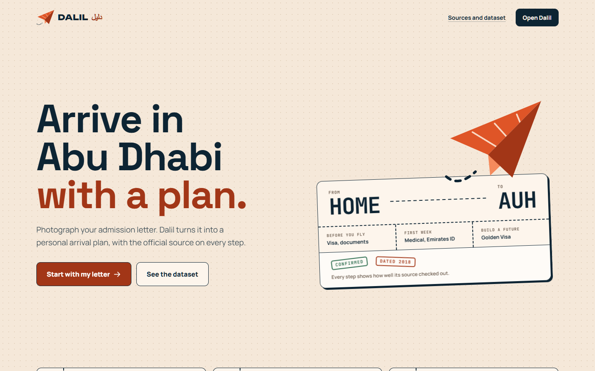
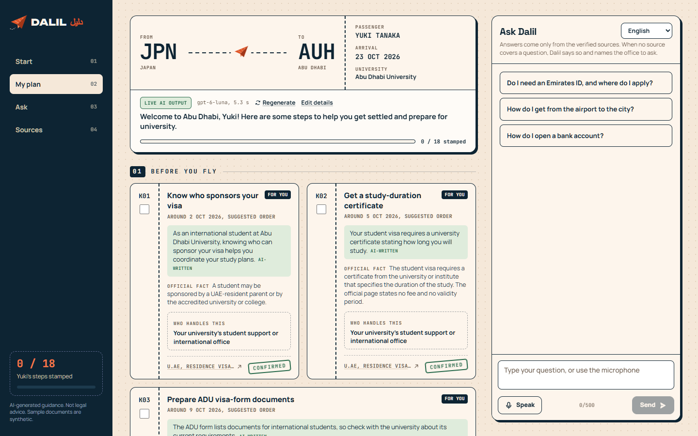
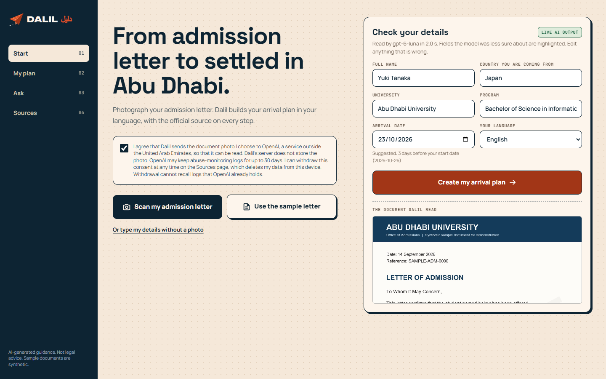
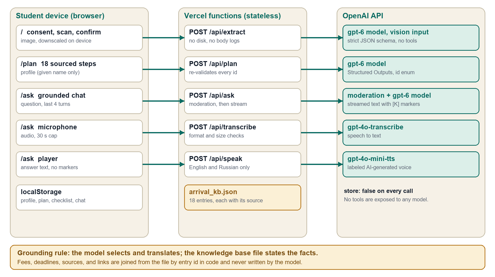

# Dalil: an AI arrival guide for international students in Abu Dhabi

Team 404 (Muhammet Yalkapov and Sulaymon Sadullo), Hub71+ AI Hackathon supported by OpenAI, 2 October 2026.

Live demo: https://dalil-abudhabi.vercel.app (no login; press "Start with my letter", tick the consent box, and choose "Use the sample letter").

## What it does

A student photographs an admission letter. Dalil reads it, builds a personal arrival plan in the student's language, and shows the official source on every step. The student can check a passport against the validity rule on the university's visa form and ask questions by text or voice. When no verified source covers a question, Dalil gives general guidance, labels it as unverified, and names the office that can confirm it.

The challenge is "How can we make it easier for people to arrive, settle in and build a future in Abu Dhabi?" Dalil answers it for one group: students who hold an admission letter and do not yet hold an Emirates ID, which is the stretch before the official apps become useful to them.

## How it maps to the judging criteria

| Criterion | Where to look |
|---|---|
| Real problem solved | The plan covers visa sponsorship, documents, medical test, Emirates ID, transport, insurance, UAE Pass, and the graduate Golden Visa. Literature and context are in `docs/Dalil_Report.pdf`. |
| Working and deployed | Live at the URL above. `scripts/smoke.mjs` probes every AI route. |
| Use of OpenAI tooling | Vision with Structured Outputs reads documents, a structured call personalizes the plan, a streamed call answers questions, moderation screens input, and speech models handle voice. See `lib/openai.ts`, `lib/schemas.ts`, `lib/prompts.ts`. |
| Clarity of demo | One journey: letter, plan, passport flag, sourced answer, labeled general guidance. |
| Differentiation | The model selects and translates; a verified file states the facts. The model never writes a fee, a deadline, or a link. |
| Unique dataset | `data/arrival_kb.json`: 19 arrival steps, each traced to an official page and labeled with the result of an independent fact-check. The evidence behind it, including the claims that were rejected, is in `docs/evidence/`. The Sources page offers the dataset as a CSV download (`/api/dataset/csv`) and as a printable page that saves as a PDF (`/dataset/print`). |
| Unique UI | The plan is a boarding pass and a set of tickets. Each step carries a rubber stamp that shows its fact-check status, and ticking a step stamps it done. A document scanner fills the form, a passport flag is computed in code, and the assistant sits beside the plan on wide screens. |
| New problem discovered | Students need guidance before they hold an Emirates ID. Several official pages could not be opened on the day, and the university's public visa form dates from 2018, so Dalil shows the age of every source instead of hiding it. |

## Screens







## Architecture



- Next.js 16 (App Router, TypeScript, Tailwind) with five stateless route handlers under `app/api`.
- No database. Profile, plan, checklist, and chat live in the browser's localStorage. Document images are never stored.
- The knowledge base file is imported by both the pages and the prompts, so the facts on screen and the facts in the prompt are the same bytes.
- The plan schema restricts the step identifier to the list generated from the file, and `lib/validate.ts` drops any identifier that is not in the file.
- Every Responses API call sets `store: false`, and no call exposes tools to the model.
- The plan call is hedged: if the first request has not answered in 9 seconds, a second starts and the faster one wins.
- Every live call has a labeled fallback: "Standard plan", "Saved example", or "Offline answer from verified sources".

## Models

| Feature | Model |
|---|---|
| Read the admission letter and the passport | `OPENAI_VISION_MODEL` (default `gpt-6.1-sol`; the deployment uses `gpt-6-luna` for speed), image input, strict JSON schema |
| Personalize the plan | `OPENAI_MODEL` (default `gpt-6.1-sol`), Structured Outputs |
| Answer questions | `OPENAI_MODEL`, streamed, after `omni-moderation-latest` |
| Voice input and output | `gpt-4o-transcribe` and `gpt-4o-mini-tts` |

## Test results

Results of the live probes and the browser walkthrough are in section 8 of `docs/Dalil_Report.pdf`.

## Limits

- The prototype is a guide. It submits no application, makes no eligibility judgment, and gives no legal advice.
- Facts from Abu Dhabi University come from a visa form dated 2018, and no current university fee is shown.
- How to open a bank account, the entry permit procedure, and lease registration are not covered, because no official page that could be opened supports them.
- The buddy card and both sample documents are sample data. The persona is fictional.
- Photos and questions are sent to OpenAI for processing. The Dalil server stores no documents.

## Repository layout

```text
app/            landing page (/), product screens (/start, /plan, /ask, /about), and API routes
components/     interface components
lib/            types, prompts, schemas, validation, checks, marker parser
data/           arrival_kb.json, the verified knowledge base
public/demo/    synthetic sample documents and saved examples
scripts/        smoke.mjs, live probes for every AI route
docs/           report, pitch deck, architecture figure, screenshots, evidence files
```
